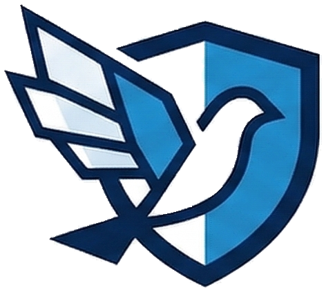

# 证证鸽 (ZhengZhengGe)

<p align="center">
  
</p>

> **智能知识产权侵权取证与 AI 文书生成平台**

[](https://opensource.org/licenses/MIT)
[](https://www.python.org/)
[](https://nextjs.org/)
[](https://fastapi.tiangolo.com/)

## 一句话定位

**从发现侵权线索到生成可供律师直接提交的 Word 文档，一站式完成。**

---

## 两大核心用户操作链路

### 链路一：主动取证 → 一键生成文书

```
[1] 发现疑似侵权页面
           ↓
[2] 点击浏览器插件「一键取证」
           ↓
[3] 系统自动采集：URL、标题、正文、HTML、截图、抓取时间
           ↓
[4] 系统自动创建「案件」+「证据包」
           ↓
[5] AI 自动生成 Word 文书草稿（律师函 / 平台投诉函）
           ↓
[6] 律师审核 → 直接提交
```

**适用场景**：法务人员主动巡查、人工发现疑似侵权页面

---

### 链路二：智能监控 → 自动生成文书

```
[1] 配置监控任务：目标站点 + 关键词 + 巡检频率 + 风险阈值
           ↓
[2] 系统自动巡检，持续发现高风险页面
           ↓
[3] 命中规则 → 自动创建「案件」+「证据包」
           ↓
[4] AI 自动生成 Word 文书草稿
           ↓
[5] 律师审核 → 直接提交
```

**适用场景**：品牌方持续监测竞品侵权、电商平台监测假冒店铺

---

## AI 价值

| 传统方式 | 使用证证鸽后 |
|---------|-------------|
| 人工收集截图、整理证据 | 插件一键，后台自动抓取 |
| 人工撰写文书 | AI 参照模板自动生成 |
| 多人多次传递 | 全流程自动，律师只审结果 |

---

## 技术架构

```
┌─────────────────────────────────────────────────────────────┐
│                      用户端                                  │
├──────────────┬──────────────────┬──────────────────────────┤
│  浏览器插件   │     Web 工作台     │      移动端（预留）       │
│  (Plasmo)   │    (Next.js)     │                          │
└──────┬───────┴────────┬─────────┴──────────────────────────┘
       │                │
       ↓                ↓
┌──────────────────────────────────────┐
│           API 网关 (FastAPI)          │
├──────────────┬───────────────────────┤
│   Hermes     │    LLM (MiMo)        │
│  Orchestrator│   文书生成 / 摘要      │
├──────────────┼───────────────────────┤
│  Playwright  │  Notification         │
│  页面抓取    │  邮件 / Webhook       │
├──────────────┴───────────────────────┤
│            SQLite 数据库              │
└─────────────────────────────────────┘
```

### 技术选型

| 层级 | 技术选型 |
|------|---------|
| 浏览器插件 | Plasmo |
| Web 前端 | Next.js 14, React, TailwindCSS |
| 后端 API | FastAPI, Python 3.11+ |
| 数据库 | SQLite |
| 页面抓取 | Playwright |
| 大语言模型 | OpenAI-compatible API (MiMo) |
| 任务编排 | Hermes Orchestrator |
| 通知推送 | Email (SMTP) / Webhook |

---

## 快速开始

### 环境要求

- **Node.js**: 18+
- **pnpm**: 9+
- **Python**: 3.11+
- **uv**: (Python 包管理器)

### 1. 克隆项目

```bash
git clone https://github.com/Keith9922/zhenzhengge.git
cd zhenzhengge
```

### 2. 安装前端依赖

```bash
pnpm install
```

### 3. 配置并启动后端 API

```bash
# 进入 API 目录
cd apps/api

# 复制环境变量配置
cp .env.example .env

# 安装 Python 依赖
uv sync

# 启动后端服务
uv run uvicorn app.main:app --reload --host 0.0.0.0 --port 8000
```

后端启动后，访问 http://localhost:8000/docs 查看 API 文档。

### 4. 启动 Web 前端（新终端窗口）

```bash
# 在项目根目录执行
cd apps/web

# 复制环境变量
cp .env.example .env.local

# 启动开发服务器
pnpm dev
```

前端启动后，访问 http://localhost:3000

### 5. 安装浏览器插件

```bash
cd apps/extension

# 复制环境变量
cp .env.example .env

# 构建插件
pnpm build

# 在浏览器中加载插件
# Chrome: 打开 chrome://extensions/
# 启用「开发者模式」
# 点击「加载已解压的扩展程序」
# 选择 apps/extension/build/chrome-mv3-dev
```

---

## 项目结构

```
zhenzhengge/
├── apps/
│   ├── api/                    # FastAPI 后端
│   │   ├── app/
│   │   │   ├── api/           # API 路由
│   │   │   ├── core/          # 核心配置
│   │   │   ├── schemas/       # 数据模型
│   │   │   └── services/      # 业务服务
│   │   ├── tests/             # 测试
│   │   ├── scripts/           # 工具脚本
│   │   ├── .env.example       # 环境变量示例
│   │   └── pyproject.toml     # Python 依赖
│   │
│   ├── web/                    # Next.js 前端
│   │   ├── app/               # 页面
│   │   ├── components/        # 组件
│   │   ├── lib/               # 工具函数
│   │   ├── public/            # 静态资源
│   │   ├── .env.example       # 环境变量示例
│   │   └── package.json
│   │
│   └── extension/              # 浏览器插件
│       ├── src/               # 源码
│       ├── assets/            # 资源文件
│       ├── .env.example       # 环境变量示例
│       └── package.json
│
├── docs/                       # 文档
├── scripts/                    # 工具脚本
├── README.md
└── LICENSE
```

---

## 环境变量说明

### API 后端 (`apps/api/.env`)

```env
# 数据库
ZHZG_DATABASE_URL=sqlite:///./data/zhenzhengge.db

# CORS（允许的前端地址）
ZHZG_CORS_ORIGINS=["http://localhost:3000"]

# LLM 配置
ZHZG_LLM_PROVIDER=mimo
ZHZG_LLM_BASE_URL=https://token-plan-cn.xiaomimimo.com/v1
ZHZG_LLM_API_KEY=your_api_key_here
ZHZG_LLM_MODEL=mimo-v2-pro

# 通知配置（可选）
ZHZG_SMTP_HOST=smtp.example.com
ZHZG_SMTP_PORT=587
ZHZG_SMTP_USERNAME=
ZHZG_SMTP_PASSWORD=
ZHZG_SMTP_FROM_EMAIL=
```

### Web 前端 (`apps/web/.env.local`)

```env
API_BASE_URL=http://127.0.0.1:8000
NEXT_PUBLIC_REPO_URL=https://github.com/Keith9922/zhenzhengge
```

### 浏览器插件 (`apps/extension/.env`)

```env
PLASMO_PUBLIC_API_BASE_URL=http://127.0.0.1:8000
PLASMO_PUBLIC_WEB_BASE_URL=http://localhost:3000
PLASMO_PUBLIC_ALLOW_SIMULATED_SUBMISSION=false
```

---

## 常用开发命令

```bash
# 后端 API
pnpm dev:api              # 启动 API 服务
pnpm test:api             # 运行测试
pnpm smoke:api            # 烟雾测试

# Web 前端
pnpm dev:web              # 启动前端开发服务器
pnpm build:web            # 构建生产版本

# 浏览器插件
pnpm dev:extension        # 开发模式
pnpm build:extension      # 构建生产版本
```

---

## 功能模块

| 模块 | 说明 | 状态 |
|------|------|------|
| 浏览器插件取证 | 一键采集 URL、标题、正文、HTML、截图 | ✅ 已完成 |
| 案件管理 | 案件列表、详情、风险评分、处理建议 | ✅ 已完成 |
| 证据包管理 | 证据沉淀、截图预览、HTML 片段 | ✅ 已完成 |
| 智能监控 | 配置站点、关键词、频率、风险阈值 | ✅ 已完成 |
| AI 文书生成 | 律师函、平台投诉函、证据目录 | ✅ 已完成 |
| Word 导出 | 一键导出标准 .docx 文件 | ✅ 已完成 |
| 邮件通知 | 命中规则后自动推送 | ✅ 已完成 |
| 可信时间戳 | 取证固证时间认证 | 🔜 规划中 |

---

## 后续规划

- [ ] **可信时间戳固证**：接入可信时间戳 API，取证时间即时固化
- [ ] **定时自动监测**：后台持续巡检，无需人工干预
- [ ] **登录与权限**：团队协作、角色权限管理
- [ ] **审计回溯**：操作日志、证据链追溯

---

## License

MIT License - see [LICENSE](LICENSE) file for details.

---

## 证证鸽

证证鸽是一个面向知识产权侵权响应场景的取证、固证、预警和文书辅助平台。

**核心目标**：把「网页侵权线索」，变成「可供律师直接提交的 Word 文档」。
