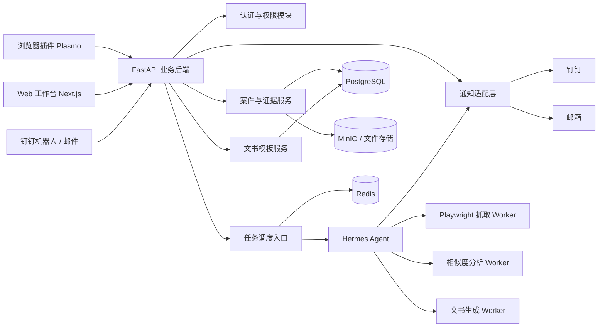
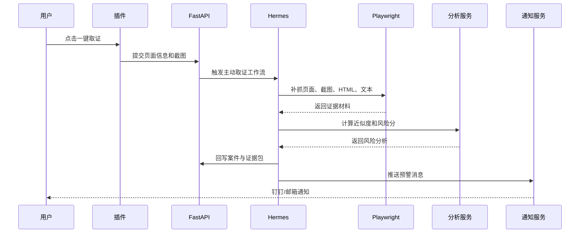
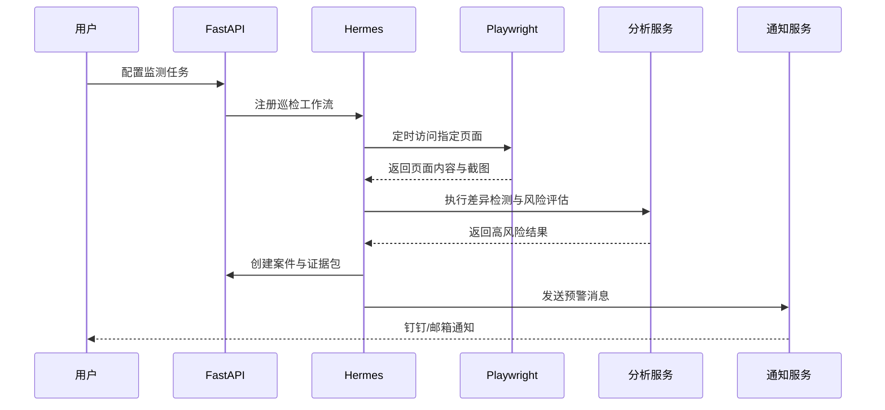
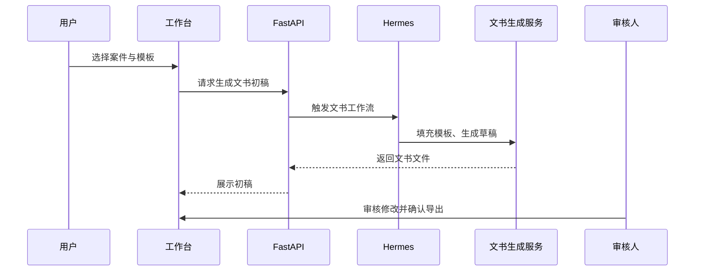

# 证证鸽模块架构与开发任务清单

> 版本：`v0.1`  
> 依据：`docs/zhenzhengge-tech-selection.md`  
> 目标：把第一阶段技术选型落成工程模块和可执行开发任务。

## 1. 第一阶段目标

第一阶段只要求跑通这条主链路：

1. 用户在指定页面发现疑似侵权内容
2. 插件一键取证
3. 服务端补抓页面并生成证据包
4. 系统完成近似比对和风险评级
5. 钉钉 / 邮箱收到预警
6. 工作台选择模板并生成文书初稿
7. 审核人复核并导出

## 2. 模块架构

## 3. 模块职责拆分

### 3.1 插件端

### 模块

- 页面信息采集
- 用户备注输入
- 一键取证提交
- 当前页截图与基础元数据收集

### 输入

- 当前 URL
- 页面标题
- 可视区截图或 DOM 片段
- 用户手动备注

### 输出

- 发往业务后端的“取证请求”

### 3.2 Web 工作台

### 模块

- 登录与身份绑定
- 案件列表
- 证据包详情页
- 风险分析结果页
- 文书模板选择页
- 审核与导出页

### 目标

- 承担主要的人机交互和审核流
- 不在前台暴露 Hermes 的原始能力

### 3.3 FastAPI 业务后端

### 模块

- 鉴权与 RBAC
- 案件管理 API
- 证据包 API
- 任务触发 API
- 模板管理 API
- 审核流 API
- 通知配置 API

### 目标

- 作为全系统唯一可信入口
- 在这里做角色判断和案件级权限校验

### 3.4 Hermes Agent 编排层

### 模块

- 主动取证工作流
- 自动巡检工作流
- 风险分析工作流
- 文书生成工作流
- 通知工作流

### 目标

- 串联后台步骤
- 控制任务顺序、重试、回写
- 不直接给用户开放自由交互

### 3.5 Playwright 抓取 Worker

### 模块

- 页面打开
- 截图
- HTML 保存
- 文本抽取
- 图片资源链接抽取

### 输出

- 标准化证据原始材料

### 3.6 相似度分析 Worker

### 模块

- 品牌词标准化
- 拼音转换
- 文本近似度计算
- 图片感知哈希
- 综合风险评分

### 输出

- 风险等级
- 命中原因
- 疑似侵权点摘要

### 3.7 文书生成 Worker

### 模块

- 案件结构化
- 模板变量映射
- Word 草稿生成
- 导出前格式补全

### 输出

- 律师函初稿
- 平台投诉函初稿
- 后续可扩展举报材料

### 3.8 通知适配层

### 模块

- 钉钉推送
- 邮件推送
- 通知消息模板
- 失败重试

### 输出

- 钉钉卡片消息
- 邮件摘要消息

## 4. 三条关键业务链路

### 4.1 主动取证链路

### 4.2 自动监测链路

### 4.3 文书生成链路

## 5. 第一阶段开发任务清单

### 5.1 基础设施与项目初始化

### 任务

- 初始化 `frontend-web`
- 初始化 `extension`
- 初始化 `backend-api`
- 初始化 `worker` / `hermes-runtime`
- 配置 `PostgreSQL`
- 配置 `Redis`
- 配置 `MinIO` 或本地文件存储

### 验收标准

- 四个项目可以独立启动
- 后端能连通数据库和对象存储
- 本地开发环境有统一启动方式

### 5.2 认证与权限

### 任务

- 设计角色模型：`viewer`、`operator`、`reviewer`、`admin`
- 实现登录与会话
- 实现案件级访问控制
- 实现操作审计日志

### 验收标准

- 不同角色访问同一案件时权限正确
- 所有文书生成、审核、导出动作有日志

### 5.3 插件一键取证

### 任务

- 插件 popup UI
- 当前页 URL、标题采集
- 当前页基础截图
- 用户备注输入
- 提交到后端

### 验收标准

- 在淘宝 / 京东 / 拼多多 / 品牌官网页面可成功提交
- 后端能收到完整请求

### 5.4 服务端补抓与证据包生成

### 任务

- Playwright 打开页面
- 生成全页截图
- 保存 HTML
- 抽取正文文本和图片链接
- 计算文件哈希
- 组装证据包

### 验收标准

- 一个案件至少包含：
  - URL
  - 标题
  - 抓取时间
  - 全页截图
  - HTML
  - 文本摘要
  - 哈希值

### 5.5 近似比对与风险评分

### 任务

- 品牌词标准化
- 拼音辅助规则
- RapidFuzz 文本打分
- imagehash 图片打分
- 组合风险评分
- 输出解释字段

### 验收标准

- 对预设样例可以输出：
  - 近似度
  - 风险等级
  - 命中原因

### 5.6 通知推送

### 任务

- 封装通知适配层
- 接入钉钉机器人
- 接入邮件发送
- 设计统一通知模板

### 验收标准

- 高风险案件创建后可自动推送钉钉消息
- 高风险案件创建后可自动推送邮件摘要

### 5.7 工作台 UI

### 任务

- 案件列表页
- 案件详情页
- 证据预览页
- 风险评分展示页
- 模板选择页
- 审核导出页

### 验收标准

- 能完整查看一个案件从证据到文书的状态

### 5.8 文书初稿生成

### 任务

- 定义律师函模板变量
- 定义平台投诉函模板变量
- docxtpl 填充
- python-docx 做导出后修整
- 文书版本记录

### 验收标准

- 能导出 `.docx` 文书初稿
- 文书字段与案件事实对应

### 5.9 审核流

### 任务

- 审核状态机
- 审核意见记录
- 最终版本导出

### 验收标准

- 文书必须经过审核才能进入“可导出正式版”状态

### 5.10 Hermes 工作流接入

### 任务

- 实现主动取证工作流
- 实现文书生成工作流
- 实现通知工作流
- 预留自动巡检工作流接口

### 验收标准

- Hermes 可串联主动取证、分析、推送、文书生成四个步骤

## 6. 任务优先级

### 6.1 P0 必做

- 基础设施
- 认证与权限基础版
- 插件一键取证
- 服务端补抓
- 证据包生成
- 文本 / 图片近似比对
- 钉钉 / 邮件推送
- 案件工作台基础页
- 律师函 / 平台投诉函初稿
- 审核导出

### 6.2 P1 可做

- 自动监测任务配置
- 页面变化差异展示
- 举报材料草稿
- 更丰富的钉钉动作按钮

### 6.3 P2 预留

- 海外站点
- 飞书 / 企业微信
- 语义检索增强
- 历史案例驱动优化

## 7. 推荐开发顺序

### 第一轮

- 基础设施
- FastAPI 基础后端
- 插件一键取证
- Playwright 补抓

### 第二轮

- 案件与证据包页面
- 风险评分
- 钉钉 / 邮件推送

### 第三轮

- 文书模板
- 审核流
- 导出

### 第四轮

- Hermes 串接为完整工作流
- 自动监测入口预留

## 8. 当前不建议过度投入的模块

- 开放式机器人对话
- 自动举报 / 自动投诉
- 发明专利复杂判侵
- 全网泛化抓取
- 多法域文书体系

## 9. 下一步建议

基于这份文档，下一步最适合继续输出：

1. 接口清单
2. 数据库表设计
3. 页面信息架构
4. Sprint 拆分表
