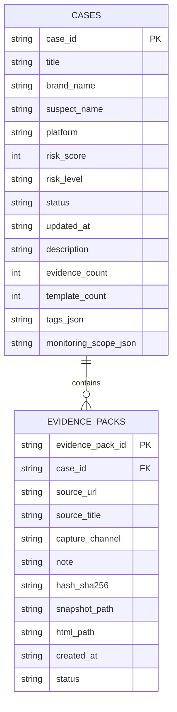
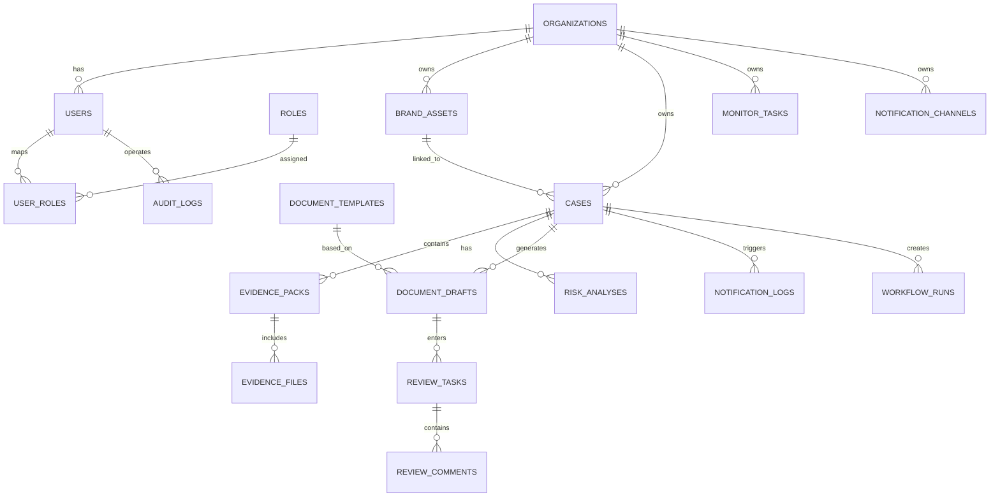

# 证证鸽数据库设计文档

> 文档类型：数据库与 ER 设计基线  
> 版本：v0.2  
> 更新时间：2026-04-11  
> 说明：本文档区分“当前已实现数据库结构”和“目标数据库结构”。开发、迁移、建模时不能把两者混用。

## 1. 当前数据库状态

当前项目已经在使用 SQLite 持久化。

数据库文件：

- [zhenzhengge.db](/Users/ronggang/code/funcode/mofa/apps/api/data/zhenzhengge.db)

当前实现代码：

- [storage.py](/Users/ronggang/code/funcode/mofa/apps/api/app/core/storage.py)

结论：

- 当前数据库是**真实可写**的
- 当前数据库是**极简版本**
- 当前只建了两张核心业务表：
  - `cases`
  - `evidence_packs`

## 2. 当前已实现 ER 图

## 3. 当前已实现表结构

### 3.1 `cases`

用途：

- 存案件主数据
- 作为工作台案件列表与详情的主表

字段：

| 字段 | 类型 | 说明 |
| --- | --- | --- |
| `case_id` | TEXT PK | 案件主键 |
| `title` | TEXT | 案件标题 |
| `brand_name` | TEXT | 品牌名 |
| `suspect_name` | TEXT | 疑似主体 |
| `platform` | TEXT | 来源平台 |
| `risk_score` | INTEGER | 风险分 |
| `risk_level` | TEXT | 风险等级 |
| `status` | TEXT | 案件状态 |
| `updated_at` | TEXT | 更新时间 |
| `description` | TEXT | 案件描述 |
| `evidence_count` | INTEGER | 证据数量 |
| `template_count` | INTEGER | 模板数量 |
| `tags_json` | TEXT | 标签 JSON |
| `monitoring_scope_json` | TEXT | 监控范围 JSON |

### 3.2 `evidence_packs`

用途：

- 存证据包元数据
- 记录来源 URL、标题、抓取渠道和文件路径

字段：

| 字段 | 类型 | 说明 |
| --- | --- | --- |
| `evidence_pack_id` | TEXT PK | 证据包主键 |
| `case_id` | TEXT FK | 关联案件 |
| `source_url` | TEXT | 来源 URL |
| `source_title` | TEXT | 来源标题 |
| `capture_channel` | TEXT | 抓取来源 |
| `note` | TEXT | 备注 |
| `hash_sha256` | TEXT | 内容哈希 |
| `snapshot_path` | TEXT | 截图路径 |
| `html_path` | TEXT | HTML 路径 |
| `created_at` | TEXT | 创建时间 |
| `status` | TEXT | 状态 |

## 4. 当前数据库的限制

当前数据库还缺这些关键对象：

- 用户
- 角色
- 组织
- 模板
- 文书草稿
- 审核任务
- 监控任务
- 通知配置
- 通知日志
- 工作流运行记录
- 审计日志

所以当前 SQLite 只能支撑：

- 案件
- 证据包

还不能支撑：

- 权限体系
- 审核流
- 通知配置
- 文书生成记录
- 监控任务管理

## 5. 目标数据库 ER 图

这是后续完整版本建议结构，不是当前已落地结构。

## 6. 目标数据库表建议

后续建议补这些表：

- `organizations`
- `users`
- `roles`
- `user_roles`
- `brand_assets`
- `risk_analyses`
- `evidence_files`
- `document_templates`
- `document_drafts`
- `review_tasks`
- `review_comments`
- `monitor_tasks`
- `notification_channels`
- `notification_logs`
- `workflow_runs`
- `audit_logs`

## 7. 推荐的演进路线

### 第一阶段已经有

- `cases`
- `evidence_packs`

### 第二阶段建议新增

- `document_templates`
- `document_drafts`
- `review_tasks`
- `review_comments`

### 第三阶段建议新增

- `organizations`
- `users`
- `roles`
- `user_roles`
- `monitor_tasks`
- `notification_channels`
- `notification_logs`
- `workflow_runs`
- `audit_logs`

## 8. 当前开发建议

如果你说“继续开发”，数据库线建议按这个顺序补：

1. `document_drafts`
2. `review_tasks`
3. `monitor_tasks`
4. `notification_channels`
5. `audit_logs`

理由很简单：

- 这 5 个表最直接支撑你下一步要做的功能
- 不用一上来就把完整 RBAC 全部打完

