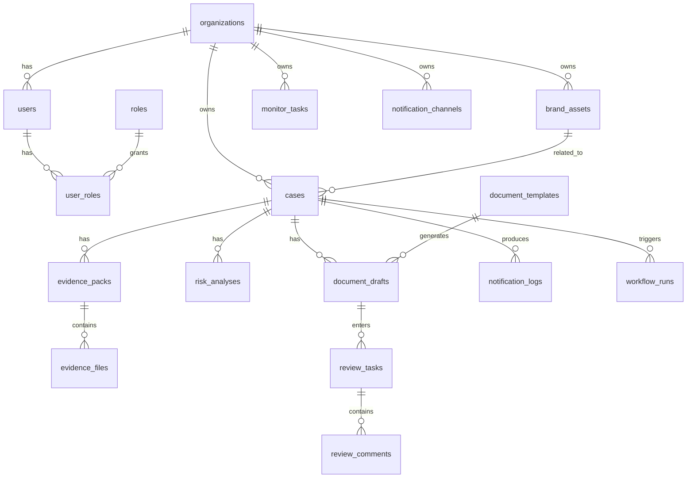

# 证证鸽数据库表设计

> 版本：`v0.1`  
> 目标：定义第一阶段数据库核心对象与关系，作为后端建模和迁移脚本设计基线。

## 1. 设计原则

1. 先保证案件、证据、模板、审核四条主线可跑通。
2. 文件类大对象不直接存数据库，数据库只存元数据与引用地址。
3. 所有关键动作要可追踪、可审计。

## 2. 核心实体

第一阶段建议至少落以下表：

- `users`
- `roles`
- `user_roles`
- `organizations`
- `brand_assets`
- `cases`
- `evidence_packs`
- `evidence_files`
- `risk_analyses`
- `document_templates`
- `document_drafts`
- `review_tasks`
- `review_comments`
- `monitor_tasks`
- `notification_channels`
- `notification_logs`
- `workflow_runs`
- `audit_logs`

## 3. 表结构建议

## 3.1 organizations

字段：

- `id`
- `name`
- `created_at`
- `updated_at`

## 3.2 users

字段：

- `id`
- `organization_id`
- `email`
- `name`
- `status`
- `created_at`
- `updated_at`

## 3.3 roles

字段：

- `id`
- `code`  
  值建议：`viewer`、`operator`、`reviewer`、`admin`
- `name`

## 3.4 user_roles

字段：

- `id`
- `user_id`
- `role_id`

## 3.5 brand_assets

字段：

- `id`
- `organization_id`
- `name`
- `asset_type`  
  值建议：`trademark_word`、`trademark_logo`、`brand_name`
- `text_value`
- `image_file_url`
- `notes`
- `created_at`

## 3.6 cases

字段：

- `id`
- `organization_id`
- `brand_asset_id`
- `title`
- `source_type`
- `source_site`
- `source_url`
- `status`
- `risk_level`
- `summary`
- `created_by`
- `created_at`
- `updated_at`

状态建议：

- `new`
- `analyzed`
- `drafting`
- `reviewing`
- `done`

## 3.7 evidence_packs

字段：

- `id`
- `case_id`
- `captured_at`
- `page_title`
- `page_url`
- `page_hash`
- `text_summary`
- `notes`
- `created_at`

## 3.8 evidence_files

字段：

- `id`
- `evidence_pack_id`
- `file_type`  
  值建议：`full_screenshot`、`html`、`text`、`image_list`、`attachment`
- `file_url`
- `mime_type`
- `size_bytes`
- `created_at`

## 3.9 risk_analyses

字段：

- `id`
- `case_id`
- `text_score`
- `image_score`
- `final_score`
- `risk_level`
- `hit_reasons`
- `analyzed_at`

## 3.10 document_templates

字段：

- `id`
- `name`
- `template_type`  
  值建议：`lawyer_letter`、`platform_complaint`、`report_material`
- `file_url`
- `version`
- `enabled`
- `created_at`

## 3.11 document_drafts

字段：

- `id`
- `case_id`
- `template_id`
- `status`
- `file_url`
- `variables_json`
- `created_by`
- `created_at`
- `updated_at`

状态建议：

- `generated`
- `submitted`
- `approved`
- `rejected`

## 3.12 review_tasks

字段：

- `id`
- `draft_id`
- `reviewer_id`
- `status`
- `submitted_at`
- `completed_at`

## 3.13 review_comments

字段：

- `id`
- `review_task_id`
- `comment`
- `created_by`
- `created_at`

## 3.14 monitor_tasks

字段：

- `id`
- `organization_id`
- `target_type`
- `target_url`
- `site`
- `brand_keywords_json`
- `frequency`
- `risk_threshold`
- `status`
- `created_by`
- `created_at`

## 3.15 notification_channels

字段：

- `id`
- `organization_id`
- `channel_type`  
  值建议：`dingtalk`、`email`
- `config_json`
- `enabled`
- `created_at`

## 3.16 notification_logs

字段：

- `id`
- `case_id`
- `channel_type`
- `target`
- `status`
- `message_summary`
- `sent_at`

## 3.17 workflow_runs

字段：

- `id`
- `workflow_type`  
  值建议：`capture`、`monitor`、`generate_draft`
- `case_id`
- `status`
- `input_json`
- `output_json`
- `created_at`
- `updated_at`

## 3.18 audit_logs

字段：

- `id`
- `user_id`
- `action`
- `target_type`
- `target_id`
- `metadata_json`
- `created_at`

## 4. 关系说明

## 5. 第一阶段必须落表

P0 至少先实现：

- `users`
- `roles`
- `user_roles`
- `organizations`
- `brand_assets`
- `cases`
- `evidence_packs`
- `evidence_files`
- `risk_analyses`
- `document_templates`
- `document_drafts`
- `review_tasks`
- `monitor_tasks`
- `notification_channels`
- `workflow_runs`
- `audit_logs`

## 6. 建模建议

1. 能枚举的字段尽量枚举，不要完全放任自由字符串。
2. 所有 JSON 字段只放弹性配置，不替代核心结构字段。
3. 与对象存储有关的文件一律只存 URL 和元数据。
4. 所有关键动作都补 `created_at / updated_at`。

## 7. 下一步

基于本表下一步应补：

- SQLAlchemy 模型
- Alembic 迁移脚本
- 初始种子数据
