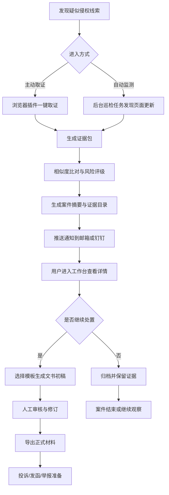
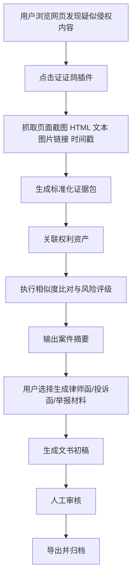
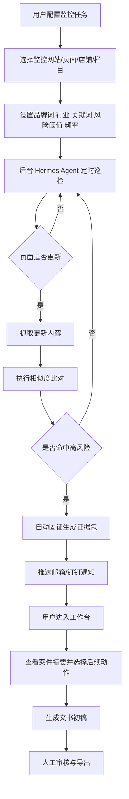
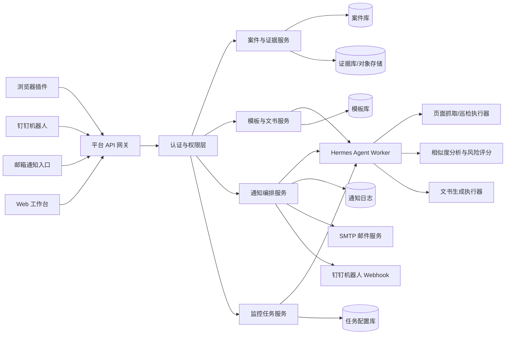

# 证证鸽用户流程图与技术路线

> 本文档用于说明证证鸽的完整产品链路，包括用户操作流程、系统处理路径、关键节点说明与技术实现路线。

## 1. 产品整体链路概览

证证鸽围绕两条核心链路展开：

- `主动取证模式`
- `自动监测模式`

两条链路最终都会汇聚到同一个案件处置闭环：

`发现线索 -> 取证固证 -> 风险分析 -> 案件结构化 -> 文书初稿 -> 人工审核 -> 导出/归档`

## 2. 用户操作流程图

### 2.1 总体流程图

### 2.2 主动取证模式流程图

### 2.3 自动监测模式流程图

## 3. 文字版流程说明

### 3.1 主动取证模式说明

适用于用户已经主动发现疑似侵权页面的场景。

#### 第一步：发现线索

用户在浏览器中访问某商品页、文章页、图片页或目标网站时，发现疑似侵权内容。

#### 第二步：一键取证

用户点击证证鸽浏览器插件，发起一键取证。插件负责采集：

- 当前 URL
- 页面标题
- 全页截图
- 当前视口截图
- 原始 HTML
- 页面文本提取结果
- 图片资源链接
- 当前抓取时间
- 哈希值
- 用户备注

#### 第三步：证据包生成

平台将上述信息整理为标准化证据包，并与对应的权利资产建立关联。

#### 第四步：风险分析

系统根据配置好的模型、规则和比对逻辑，输出：

- 相似度结果
- 风险评级
- 可能的侵权点说明
- 建议动作

#### 第五步：案件结构化

平台生成：

- 案件摘要
- 证据目录
- 时间线
- 涉案页面说明
- 可选动作

#### 第六步：文书辅助

用户在工作台中选择模板，系统生成：

- 律师函初稿
- 平台投诉函
- 举报材料草稿
- 侵权分析说明
- 证据目录

#### 第七步：人工审核

审核人员或法务人员对内容进行修订、确认与导出。

### 3.2 自动监测模式说明

适用于用户希望平台长期巡检指定网站或页面的场景。

#### 第一步：配置任务

用户在工作台中创建监控任务，指定：

- 目标网站或页面
- 品牌词/关键词
- 行业方向
- 风险阈值
- 巡检频率
- 推送方式

#### 第二步：后台巡检

Hermes 后台 Agent 按任务周期运行，抓取指定站点更新后的页面内容。

#### 第三步：自动识别

系统对新内容进行相似度比对和风险分析。

#### 第四步：自动固证

一旦命中高风险线索，系统会自动执行固证动作并生成证据包。

#### 第五步：风险推送

系统将风险摘要推送至：

- 用户邮箱
- 钉钉机器人

#### 第六步：进入工作台

用户点击消息中的链接，进入证证鸽工作台查看案件详情，并决定是否继续生成文书、提交审核或暂时归档。

## 4. 系统模块架构图

## 5. 技术路线概述

### 5.1 整体架构

推荐采用三层架构：

1. `交互层`
2. `平台层`
3. `执行层`

#### 交互层

包括：

- 浏览器插件
- Web 工作台
- 钉钉机器人
- 邮件通知

#### 平台层

包括：

- API 网关
- 认证与权限系统
- 案件管理服务
- 证据管理服务
- 模板与文书服务
- 任务调度与监控服务
- 通知服务

#### 执行层

包括：

- Hermes Agent Worker
- 页面抓取器
- 相似度分析模块
- 文书生成模块
- 模板优化与案例学习模块

## 6. 前端技术路线

### 6.1 浏览器插件

建议职责：

- 获取当前页面信息
- 执行一键抓取
- 发送数据到工作台
- 展示简要结果回执

建议能力：

- Chrome/Chromium 插件优先
- 支持截图
- 支持 DOM 文本提取
- 支持注释与备注输入

### 6.2 Web 工作台

建议职责：

- 登录与身份管理
- 权利资产管理
- 案件详情查看
- 证据包管理
- 模板选择与文书生成
- 审核与导出
- 监控任务配置

工作台应是全系统的主入口，不建议把复杂交互都塞进机器人。

## 7. 后端技术路线

### 7.1 API 与业务服务

后端需要至少具备以下服务：

- `auth-service`：身份认证、组织、角色、授权
- `case-service`：案件、状态、归档
- `evidence-service`：证据包生成、索引、哈希、下载
- `template-service`：模板管理、版本管理、变量填充
- `document-service`：文书生成、导出
- `watch-service`：监控任务配置、调度、日志
- `notify-service`：邮件和钉钉通知

### 7.2 存储设计

建议最少包含：

- 关系型数据库：案件、用户、角色、任务、通知日志
- 对象存储：截图、HTML、导出文书、证据附件
- 检索索引：文本内容、页面摘要、历史案例

## 8. Hermes 技术路线

### 8.1 Hermes 在系统中的职责

Hermes 适合承担：

- 自动巡检任务调度
- 页面更新后的任务编排
- 风险摘要生成
- 文书初稿生成
- 通知事件触发
- 案例反馈后的模板优化

### 8.2 Hermes 不应直接承担的职责

- 用户身份系统
- 全局权限控制
- 案件级访问隔离
- 管理后台逻辑
- 所有业务规则存储

因此 Hermes 应该作为：

`平台内部 Worker / Orchestrator`

而不是：

`直接裸露给用户的自由聊天机器人`

## 9. 通知技术路线

### 9.1 第一阶段主通道

- `邮箱`
- `钉钉机器人`

### 9.2 邮箱实现建议

- 平台统一配置发件邮箱
- 使用 SMTP 或第三方邮件服务发送
- 用户只需配置收件邮箱
- 邮件以摘要 + 工作台链接为主

### 9.3 钉钉机器人实现建议

推荐做成受限动作型机器人，支持：

- 推送案件摘要
- 查看详情跳转
- 触发“生成律师函”
- 触发“生成举报材料”
- 标记已收到/待处理

不建议第一版做开放式自由对话。

## 10. 模型与识别路线

### 10.1 第一阶段建议能力

- 文本相似度分析
- 图像近似识别
- 规则引擎与风险评分结合
- 简单涉案金额估算

### 10.2 输出形式

建议输出：

- 高风险
- 中风险
- 低风险
- 建议人工复核

而不是直接输出“已侵权”。

## 11. 文书生成路线

### 11.1 第一阶段建议支持的模板

- 律师函
- 平台投诉函
- 举报材料草稿
- 侵权分析说明
- 证据目录

### 11.2 生成逻辑

文书生成不应直接基于“网页原文”裸生成，而应采用：

`案件结构化数据 -> 模板填充 -> 大模型润色 -> 人工审核`

这样稳定性更高，也更容易控制风险。

## 12. 安全与权限路线

### 12.1 必须实现的安全层

- 账号绑定
- RBAC 角色控制
- 案件级访问控制
- 操作审计日志
- 文书版本留痕
- 机器人受限命令集

### 12.2 最低安全原则

- 用户不能自由调用底层 Agent
- 管理员与普通用户分离
- 所有生成动作可追溯
- 高风险动作需要人工确认
- 数据脱敏可配置

## 13. 推荐开发优先级

### P0

1. 浏览器插件一键取证
2. 证据包生成与存储
3. 工作台案件详情页
4. 简单风险分析
5. 邮件/钉钉通知
6. 律师函/投诉函初稿生成

### P1

1. 自动监测任务
2. 举报材料草稿
3. 人工审核流程
4. 文书导出
5. 历史案件归档

### P2

1. 模板优化学习
2. 更多渠道通知
3. 行业化适配
4. 多组织协同

## 14. 推荐对外技术表述

> 证证鸽采用“浏览器插件 + Web 工作台 + 后台 Hermes Agent”的三层架构。前端插件负责一键取证，工作台负责案件、证据和文书的统一管理，Hermes 负责巡检、通知和文书生成编排。系统通过权限网关、案件级隔离和人工审核机制，保证智能能力在可控边界内运行。

