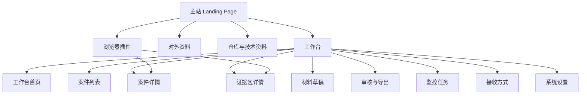

# 证证鸽信息架构

> 版本：`v0.1`  
> 目标：定义证证鸽第一阶段的页面层级、导航关系与信息归属，统一主站、工作台与插件的页面组织方式。

## 1. 信息架构原则

1. `主站与工作台分层`
主站负责品牌展示、功能介绍、文档入口与转化入口；工作台负责实际案件处理。

2. `先单线闭环，再扩多角色`
第一阶段优先围绕案件、证据、文书三条主线展开，不扩展过多后台配置页。

3. `入口集中`
对外统一由主站进入，对内统一由工作台承接动作。

## 2. 整体结构

## 3. 主站信息架构

## 3.1 页面定位

主站是证证鸽的对外入口，负责：

- 说明产品是什么
- 说明它解决什么问题
- 展示完整链路
- 提供对外资料、文档与仓库入口
- 引导进入工作台

## 3.2 推荐导航

- 首页
- 功能介绍
- 产品资料
- 仓库入口
- 进入工作台

## 3.3 首页内容分区

### 顶部导航

- 品牌标识：证证鸽
- 功能
- 文档
- 仓库
- 进入工作台

### Hero 区

- 一句话定位
- 核心价值描述
- 主 CTA：进入工作台
- 次 CTA：查看文档

### 功能能力区

- 一键取证
- 自动巡检
- 风险分析
- 通知推送
- 文书初稿
- 审核导出

### 链路说明区

用可视化步骤展示：

`发现侵权页面 -> 取证固证 -> 风险分析 -> 推送预警 -> 文书草稿 -> 审核导出`

### 场景示例区

- 电商平台商品页
- 品牌官网页面
- 指定店铺 / 指定栏目巡检

### 资源入口区

- 产品概览
- 适用场景
- 能力边界
- Git 仓库

### 页脚

- 版本信息
- 文档更新时间
- 版权与说明

## 4. 工作台信息架构

## 4.1 一级导航

- 工作台首页
- 案件
- 证据包
- 草稿
- 模板
- 监控任务
- 接收方式
- 设置

## 4.2 页面说明

### 工作台首页

展示：

- 今日新增案件
- 高风险案件
- 待审核文书
- 最近通知记录

### 案件列表页

展示：

- 案件编号
- 品牌对象
- 风险等级
- 来源站点
- 当前状态
- 创建时间

### 案件详情页

展示：

- 案件摘要
- 疑似侵权点
- 风险评分
- 证据包入口
- 可执行动作

### 证据包详情页

展示：

- URL
- 标题
- 抓取时间
- 全页截图
- HTML
- 文本摘要
- 哈希值

### 模板与文书页

展示：

- 模板列表
- 模板说明
- 生成草稿按钮
- 草稿版本列表

### 审核页

展示：

- 草稿预览
- 审核意见
- 审核状态
- 导出按钮

### 监控任务页

展示：

- 目标站点
- 目标页面 / 店铺 / 栏目
- 品牌词
- 频率
- 阈值
- 任务状态

### 接收方式页

展示：

- 默认接收入口
- 测试发送
- 启用状态

## 5. 插件信息架构

### Popup

- 当前站点信息
- 当前 URL
- 当前标题
- 备注输入
- 一键取证按钮

### 提交结果

- 提交成功 / 失败
- 案件详情链接

## 6. 第一阶段建议

第一阶段先保证以下页面完整可用：

1. 主站 Landing Page
2. 工作台首页
3. 案件列表页
4. 案件详情页
5. 证据包列表与详情页
6. 草稿列表与详情页
7. 监控任务页
8. 接收方式页
9. 插件 Popup

其他后台配置页可以先做基础壳子。
